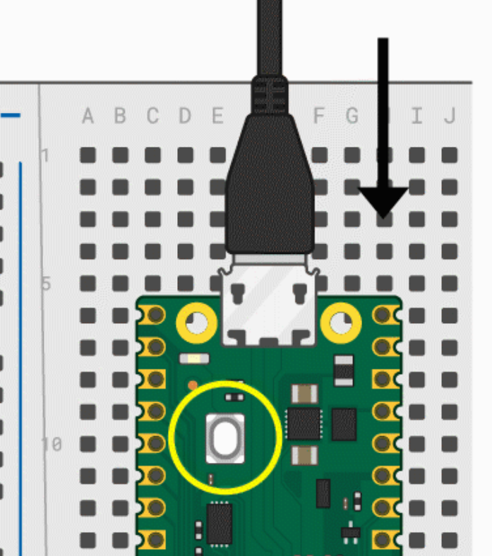

## Valid version

|Feature|Version|
|----|----|
|Double-pressing the RESET button|0.9.1+|
|Software rebooting|0.9.13+|

## Description

When you want to install a new uf2 file of PRK Firmware, make sure the mass storage drive is `RPI-RP2`, not `PRKFirmware`, which means RP2040 booted into BOOTSEL mode.

There are three ways of rebooting RP2040 into BOOTSEL mode.

### Reconnect the USB cable while pressing the BOOTSEL button of the microcontroller board



This is eligible no matter what. But I know you feel troublesome.

### Double-pressing the RESET button

- If you should be able to access the RESET button of the microcontroller board (Though Raspi Pico doesn't have a RESET button!)
  - Or, The PCB has a RESET button that connects to RP2040's reset circuit
- Then you can reboot RP2040 to BOOTSEL mode by **double-pressing** any of the RESET button
- Note that PRK Firmware should have already been installed prior to the above

### Software rebooting

I guess this is what you want.

`Keyboard#bootsel!` method will reboot RP2040 into BOOTSEL mode.
So you can configure a key as a reboot button like this:

```ruby
kbd = Keyboard.new
kbd.add_layer :default, %i(KC_A KC_B KC_C BOOTSEL)
kbd.define_mode_key :BOOTSEL, [ Proc.new { kbd.bootsel! }, nil, 200, nil]
#                                                               ^^^
#                                                       Should NOT be `nil`
kdb.start!
```
